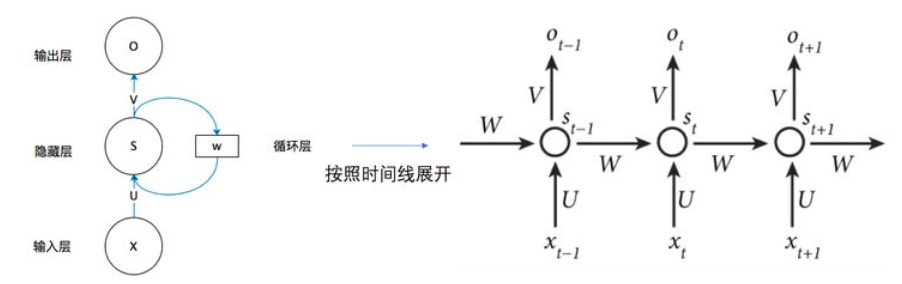
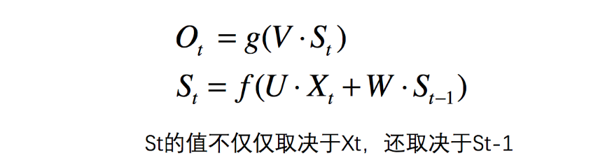
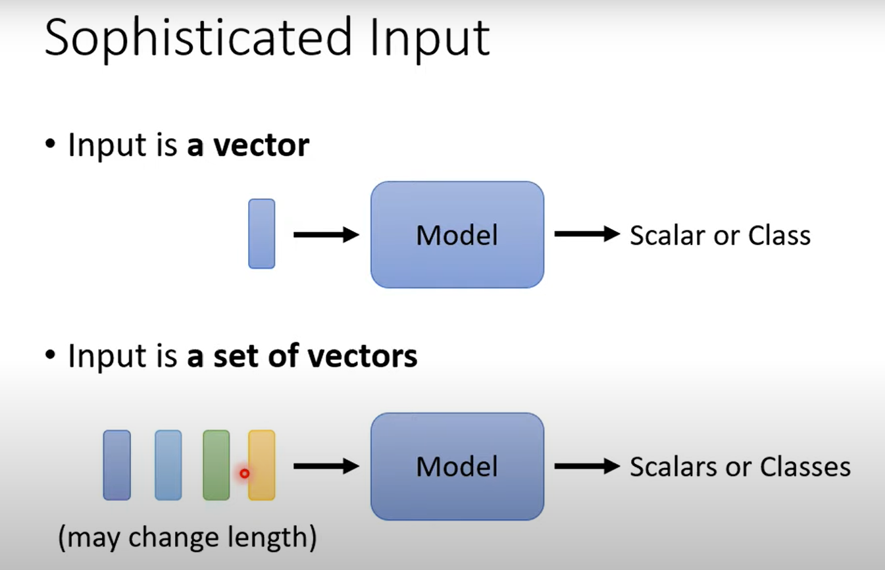
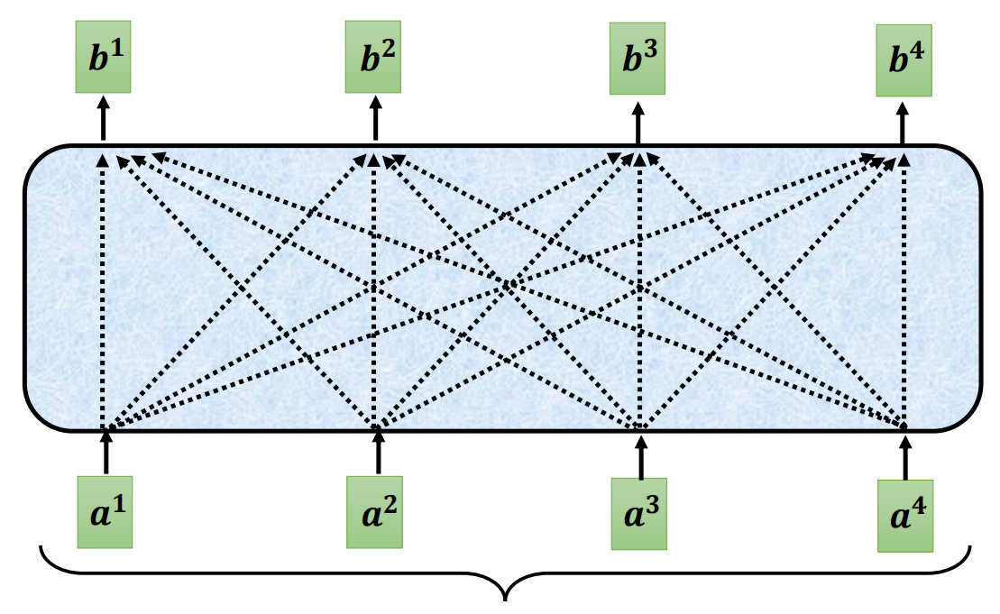
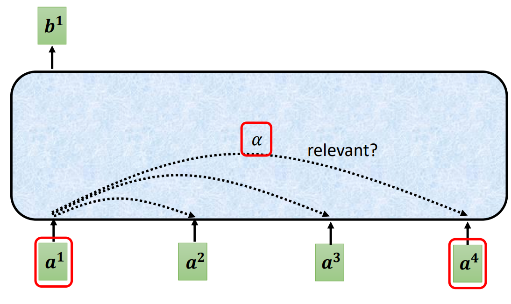
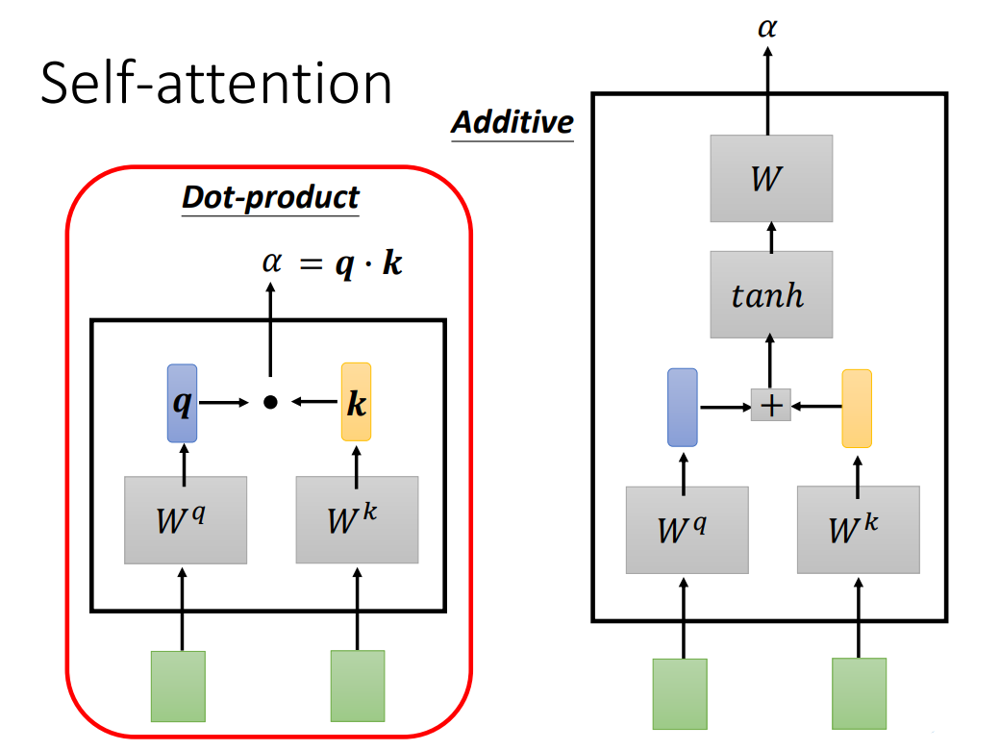
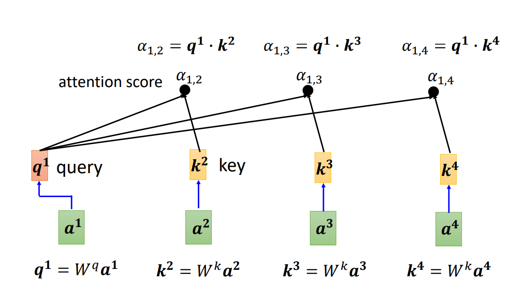
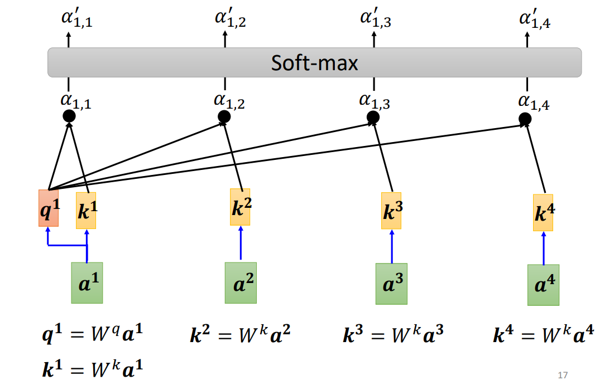
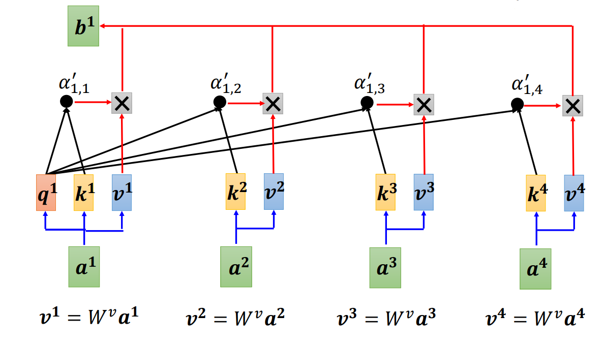
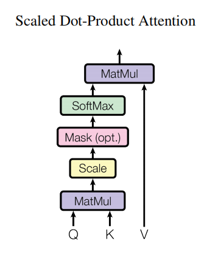

# Attention Is All You Need
主流的序列转导模型是基于复杂的循环或卷积神经网络，其中包括一个编码器和一个解码器。性能最好的模型还通过一种注意机制将编码器和解码器连接起来。本文提出了一种新的简单的网络架构，`Transformer`，完全基于`Attention`机制，完全取消递归和卷积。

## 1. 背景

### 1.1 RNN的弊端

RNN（Recurrent Neural Networks）的计算需要依赖于当前状态$S_t$的上一个状态$S_{t-1}$。

这种结构导致了计算$S_t$必须要将$S_{t-1}$计算出来，这就使得整个计算过程是串行化的，无法并行计算，同时需要记录大量的状态。尽管，通过经过很多人的努力，通过因数分解技巧和条件计算提高了计算效率，同时后者也提高了模型性能，但是`串行化计算的这一弊端没有得到根本的解决`。

### 1.2 Attention机制的兴起

最近，Attention机制在推动序列模型和转导模型的各种任务的发展上，起到了重要作用。Attention机制的计算过程不会受序列顺序的影响。但Attention机制，经常会和RNN整合使用。

### 1.3 Transformer的优势

Transformer仅使用Attention机制，脱离了RNN的束缚，来获取输入和输出序列之间的全局依赖关系。这使得Transformer的计算更加并行化，并且效率更高。

## 2. Attention机制（参考李宏毅先生的公开课）

[参考链接](https://www.youtube.com/watch?v=hYdO9CscNes&list=PLJV_el3uVTsMhtt7_Y6sgTHGHp1Vb2P2J&index=10)

Attention机制处理的问题：

1. 变长序列训练问题。
   

   对于长序列的训练，经常使用的方法是滑动窗口的方法，但该方法需要通过经验或者统计确定滑动窗口的大小。

   
2. 序列模型考虑上下文计算的问题。

### 2.1 Attention算法的流程

Attention机制是将一个Query和一组Key-Value值映射到输出的机制，在这里Query、Key、Value都是向量。

其中Query是序列当前的所在位置，而其他的Key则是序列周围的上下文。最后每个Query都会产生产生一个输出。如下图所示：

#### 2.1.1 解决序列模型上下文计算的问题

下面以计算上图中的$a^{1}$对应的结果$b^{1}$为例。每个输入数据都是一个向量，即$a^{1}$~$a^{4}$都是向量，而Attention机制会将同一个向量分为3种表示形式：Query、Key、Value。这三种表示都是由原始输入数据变换而成。Query是当前正在处理的数据变化而来的，Key是由上下文数据变化而来的。

由于Attention机制需要考虑到上下文的数据，因此需要考虑输入向量的相关性，即Query和Key的相关性。

论文中提到了两种Attention机制，`Dot-product`和`Additive`两种方式，这两张方式的区别也是计算Query和Key的相关性上有区别。下图展示了两种方式的区别。

这里以`Dot-product`为例，处理$a^{1}$时，该数据是当前正在处理的数据，可以称之为中心词，为$a^{1}$计算出对应的Query矩阵：

$q^{1}=W^{q}a^{1}$

同时为其他的上下文词$a^{2}$、$a^{3}$、$a^{4}$计算出对应的Key矩阵：

- $k^{2}=W^{k}a^{2}$
- $k^{3}=W^{k}a^{3}$
- $k^{4}=W^{k}a^{4}$

最后通过新生成的Query矩阵和Key矩阵生成Query和Key之间的相似度，根据`Dot-product`算法，这里使用的是点乘操作，即：

$a = q·k$

得到的结果有一个很好的名字，即`Attention score`。

事实上，这里甚至可以对$a^{1}$本身计算其q矩阵和k矩阵，然后计算`Attention score`。得到`Attention score`后，可以通过一些机制，对`Attention score`进行处理，本篇文章中使用的是`Softmax`，并且采取了一些其他的操作，当然这里也可以使用其余的方式:

目前为止，我们只用了Query、Key，没有使用Value，Value也是由输入向量经过一定的操作变换过来的：$v^{i}=W^{v}a^{i}$

最后的结果b1计算公式为：

$b_1=\sum_{i}a_{1,i}^{'}v^{i}$

如下图：

而其余的$b^{i}$计算方式同理。

至此，我们回顾一下《Attention Is All You Need》中的用于解释`Scaled Dot-Product Attention`的图：

也就相对好理解多了，但是论文中的描述与上面李宏毅老师的解释也有一些不同：
1. 在论文中，并未对Q、K、V的来源进行解释，只是提到了各自的维数。
2. 论文中使用的是`Scaled Dot-Product Attention`，其计算Q矩阵和V矩阵相似度时，对计算结果进行了除以$\sqrt{d_{k}}$的操作，不过整体是一致的。
   对于这一点论文中也提到了：
    Dot-product attention is identical to our algorithm, except for the scaling factor of $\frac{1}{\sqrt{d_{k}}}$

    对于这一参数的解释，也包含在论文中：当$d_{k}$值较小时，这两种算法的表现很相似，但对于较大的$d_{k}$，`Additive Attention`会优于`Dot Product Attention`。因此猜测是当$d_k$值过大时，会使得做点积时，幅度增长过大，这会更容易将数据推到softmax梯度极小的地方。

#### 2.1.2 Multi-Head Attention