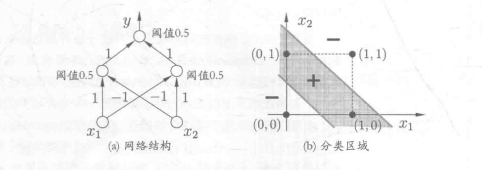

### 1.神经网络

#### 1.1. 神经网络模型

神经网络是由具有适应性的简单单元组成的广泛并行互联的网络，它的组织能够模拟生物神经系统对真实世界物体所作出的交互反应。

神经网络中最基本的成分是`神经元模型`。**在生物神经系统中，每个神经元与其他神经元相连，当它“兴奋”时，就会向相连的神经元发送化学物质，从而改变这些神经元内的电位；如果神经元的电位超过了某个“阈值”，那么它就会被激活，向其他神经元发送化学物质**。

1943年，`McCulloch and Pitts` 将上述过程抽象称为`M-P神经元模型`，在这个模型中，`神经元接收到来自n个其他神经元传递来的输入信号`，这些输入信号通过`带权重的连接`进行传递，神经元`接收到的总输入值将与神经元的阈值进行比较`，然后通过`“激活函数”`处理以产生神经元的输出。

理想中的激活函数是`阶跃函数`，它将输入值映射为输出值“0”或“1”，其中“1”对于神经元兴奋，“0”对于神经元抑制。然而，`阶跃函数具有不连续、不光滑等不太好的性质`，因此实际常用`Sigmod函数`作为激活函数。典型的Sigmod函数如下图所示，它把可能在较大范围内变化的输入值挤压到(0,1)输出范围内，因此有时也称之为`“挤压函数”`。

把许多这样的神经元按照一定层次结构连接起来，就得到了神经网络。

#### 1.2 感知机与多层网络

感知机由两层神经网络组成。

输入层接收外界输入信号后，传递给输出层，输出层是M-P神经元，亦称“阈值逻辑单元”。下图表示了一个输入层具有三个神经元（分别表示为$x_{0}$、$x_{1}$、$x_{2}$）的感知机结构：

事实上，给定训练数据集，权重$w_{i}(i=1,2,...,n)$以及阈值$\theta$都可通过学习得到，并且阈值$\theta$可以看作一个固定输入为`-1.0`的“哑结点”，所对应的连接权重是$w_{i+1}$，权重和阈值就统一为权重的学习。

感知机是一种判别式的`线性分类模型`。能容易地实现逻辑与、或、非运算，下面举一个例子，假设有如下结构的感知机：

且满足如下函数$y=f(\sum_{i}w_{i}x_{i}-\theta)$，假定$f$函数为阶跃函数。则有：

- 与（$x_{1}\wedge x_{2}$），令$w_{1}= w_{2}=1$，$\theta=2$，则$y=f(1*x_{1}+1*x_{2}-2)$，仅在$x_{1} = x_{2} = 1$时，$y=1$。
- 或（$x_{1}\vee x_{2}$），令$w_{1}= w_{2}=1$，$\theta=0.5$，则$y=f(1*x_{1}+1*x_{2}-0.5)$，仅在$x_{1}=1$ 或 $x_{2} = 1$时，$y=1$。
- 非（$\neg x_{1}$）令$w_{1}=-0.6$，$w_{2}=0$，$\theta=-0.5$，则$y=f(-0.6*x_{1}+0*x_{2}+0.5)$，仅在$x_{1}=1$时$y=0$，$x_{1}=0$时$y=1$。

感知机只有输出层神经元进行激活函数的处理，即`只拥有一层功能神经元`，其`学习能力非常有限`。`可以解决与、或、非这样的线性可分的问题`（若两类模式是线性可分的，即存在一个线性超平面能将它们分开），则感知机的学习过程一定会收敛而求得适当的权向量$w=(w_{1};w_{2};...;w_{n+1});$；`否则感知机学习过程将会发生震荡，$w$难以稳定下来，不能求得合适解`。例如，[感知机不能解决异或问题](https://www.cnblogs.com/trialley/p/11248916.html)。

*关于感知机解决异或问题还有一段历史值得我们简单去了解一下：感知器只能做简单的线性分类任务。但是当时的人们热情太过于高涨，并没有人清醒的认识到这点。于是，当人工智能领域的巨擘Minsky指出这点时，事态就发生了变化。Minsky在1969年出版了一本叫《Perceptron》的书，里面用详细的数学证明了感知器的弱点，尤其是感知器对XOR（异或）这样的简单分类任务都无法解决。`Minsky认为，如果将计算层增加到两层，计算量则过大，而且没有有效的学习算法。所以，他认为研究更深层的网络是没有价值的。`由于Minsky的巨大影响力以及书中呈现的悲观态度，让很多学者和实验室纷纷放弃了神经网络的研究。神经网络的研究陷入了冰河期。这个时期又被称为“AI winter”。接近10年以后，对于两层神经网络的研究才带来神经网络的复苏*

`要解决非线性可分问题，需考虑使用多层功能神经元`。下图的网络结构可以解决异或问题。

处于输入层和输出层之间的一层神经元，称为`隐层`或`隐含层（hidden layer）`，`隐含层和输出层都是具有激活函数的神经元`。

更一般的，常见的神经网络是形如下图的层级结构。

每层神经元与下一层神经元全互连，神经元之间不存在同层链接，也不存在跨层连接。这样的神经网络结构称之为`“多层前馈神经网络”`。

`神经网络的学习过程，就是根据训练数据来调整神经元之间的“连接权”，以及每个功能神经元的阈值`。

#### 1.2 反向传播算法（BackPropagation，BP算法，误差逆传播算法）

给定训练集$D=\{(x_{1},y_{1}),(x_{2},y_{2}),...,(x_{m},y_{m}) \}$，其中，$x_{i} \in R^{d}$，$y_{i} \in R^{l}$，即输入示例由$d$个属性描述，输出$l$维实值向量。为方便讨论，考虑如下神经网络：

该神经网络是一个具有$d$个输入神经元，$l$个输出神经元、$q$个隐层神经元的多层前馈网络结构。假设隐层和输出层神经元都使用`上面的Sigmod函数`其中
1. $\theta_{j}$:输出层第$j$个神经元的阈值用$\theta_{j}$表示
2. $\gamma_{h}$:隐层第$h$个神经元的阈值用$\gamma_{h}$表示
3. $v_{ih}$:输入层第$i$个神经元与隐层第$h$个神经元之间的连接权为$v_{ih}$
4. $w_{hj}$:隐层第$h$个神经元与输出层第$j$个神经元之间的连接权为$w_{hj}$
5. $\alpha_{h}$:隐层第$h$个神经元接收到的输入为$\alpha_{h}=\sum_{i=1}^{d}v_{ih}x_{i}$
6. $\beta_{j}$:输出层第$j$个神经元接收到的输入为$\beta_{j}=\sum_{h=1}^{q}w_{hj}b_{h}$

对训练例$(x_{k},y_{k})$，假定神经网络的输出为$\hat{y}_{k}=(\hat{y}_{1}^k,\hat{y}_{2}^k,....,\hat{y}_{l}^k)$，即

$\hat{y}_{j}^{k}=f(\beta_{j} - \theta_{j})$，即输出层第j个神经元接收到的输入-输出层第j个神经元的阈值。

则网络在$(x_{k},y_{k})$上的均方差为：

$E_{k}=\frac{1}{2}\sum_{j=1}^{l}(\hat{y}_{j}^{k}-y_{j}^{k})^2$：这里的1/2是为了后面求导的便利。